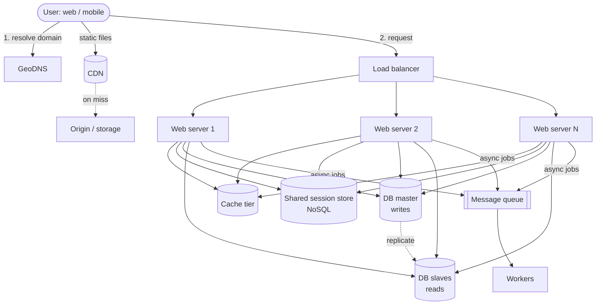
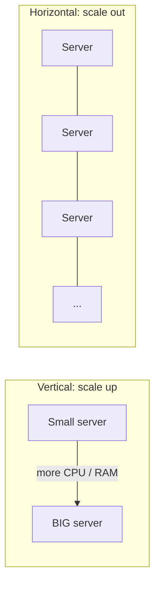
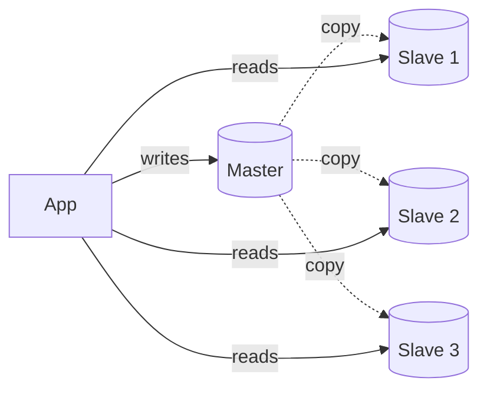
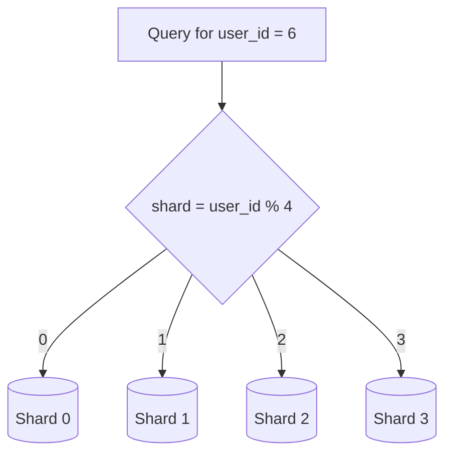
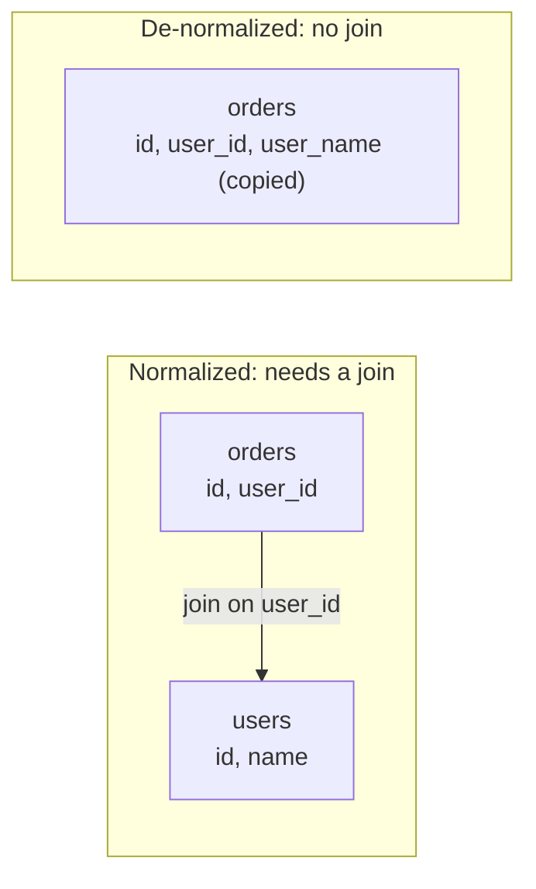
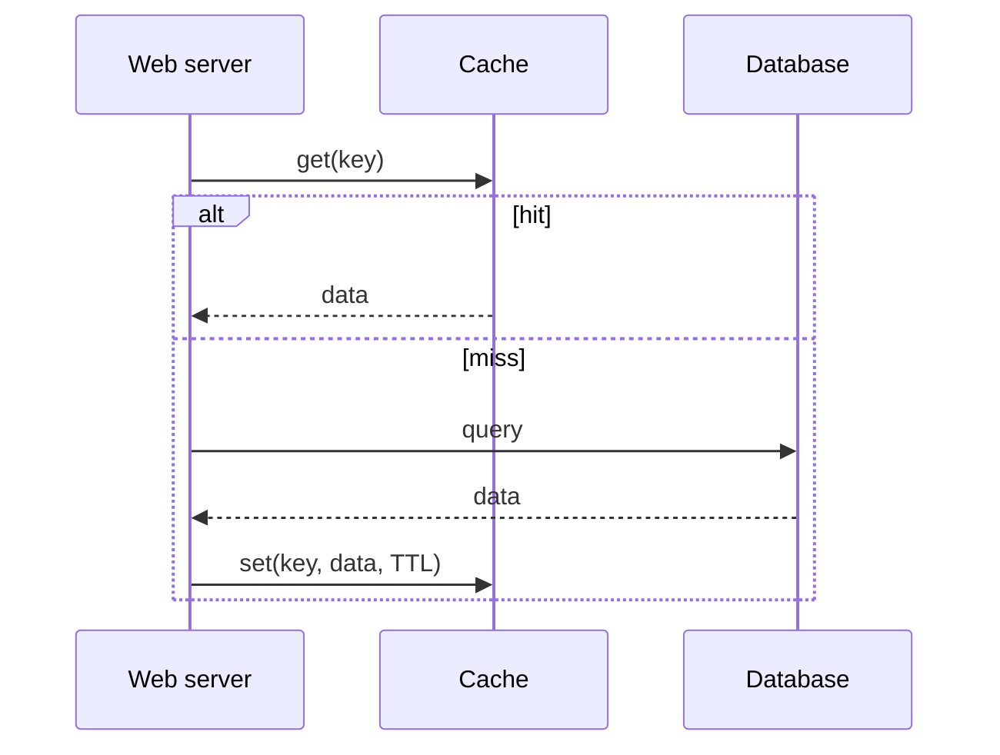
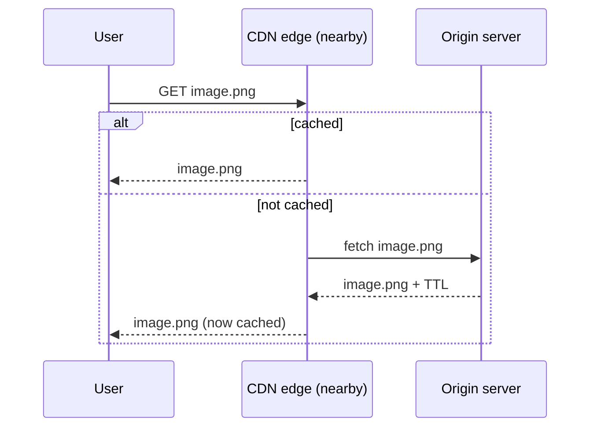
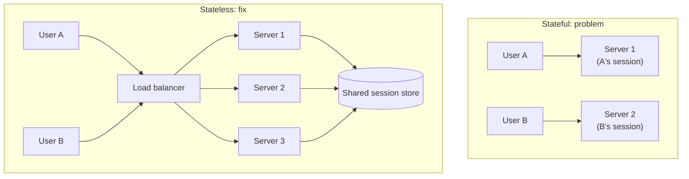
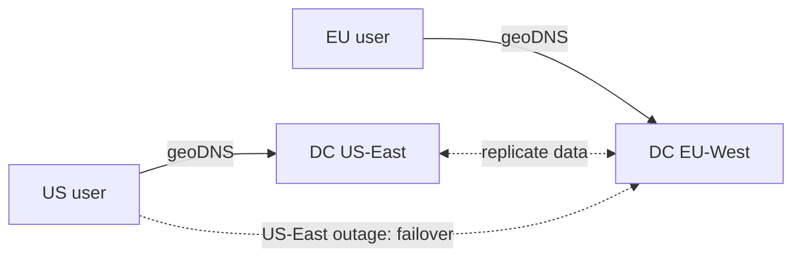
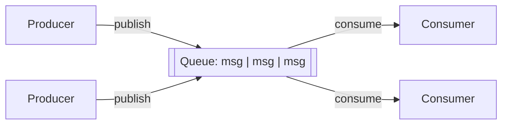

# Ch 1 — Scale From Zero to Millions of Users

> *System Design Interview* by Alex Xu. Summary notes.

## The big picture

This is where the chapter ends up: every section below adds one piece of this diagram.

## Key terms

| Term | Meaning |
|---|---|
| **DNS** (Domain Name System) | Turns a domain name (`api.example.com`) into an IP address. |
| **GeoDNS** | DNS that returns a different IP depending on where the user is, which sends them to the nearest data center. |
| **Load balancer** | Spreads incoming traffic across a pool of web servers. Users only see the LB's public IP, and a dead server is taken out of the pool. |
| **SPOF** (single point of failure) | A component that brings the whole system down when it fails. |

## Scaling: vertical vs horizontal

| | Vertical (scale up) | Horizontal (scale out) |
|---|---|---|
| How | A bigger machine | More machines |
| Pros | Simple | Can keep growing, has redundancy |
| Cons | Hardware limit, SPOF | More complex; needs a LB and a stateless design |
| Fits | Low traffic | Large-scale apps |

## Databases

### Relational vs NoSQL

| | Relational (SQL) | Non-relational (NoSQL) |
|---|---|---|
| Data model | Tables and rows | Key-value, graph, column, or document stores |
| Joins | Yes | Generally no |
| Pick it when | Default choice; data has relationships | Very low latency needed; data is unstructured or has no relations; you only save and load data such as JSON/XML/YAML; the data volume is huge |

### Replication (master / slave)

- The **master** takes all writes (insert, update, delete).
- **Slaves** hold copies of the master's data and serve only reads.
- Reads far outnumber writes, so there are usually many slaves per master.

| Benefit | Why |
|---|---|
| Performance | Reads run in parallel across slaves. |
| Reliability | The data lives in several places, so losing one server (fire, earthquake) loses no data. |
| High availability | If one DB goes offline, another one serves the traffic. |

### Scaling the database: sharding

- Vertical scaling means a bigger DB machine. Horizontal scaling means **sharding**: split rows across servers using a shard key (for example `user_id % 4`).

Sharding brings three problems:

| Problem | What happens | Fix |
|---|---|---|
| **Resharding** | One shard fills up because of fast growth, or the data is spread unevenly (shard exhaustion). | Change the sharding function and move data. Use **consistent hashing**. |
| **Celebrity / hotspot key** | Heavy traffic to one key (e.g. a celebrity) overloads its shard. | Give hot keys their own shard, or split them further. |
| **Joins** | Joins across shards are hard. | **De-normalize** so a query can be answered from one table. |

## Cache

A **cache tier** is a fast, temporary data layer in front of the DB. It improves performance, lowers DB load, and scales on its own.

**Read-through flow:**

| Consideration | Rule of thumb |
|---|---|
| When to use | Data that is read often and changed rarely. |
| Expiration | Set a TTL. Too short means frequent DB reloads; too long means stale data. |
| Consistency | Keeping the cache and DB in sync is hard, especially across regions. |
| Failures | A single cache server is a SPOF. Use several cache servers across data centers and **overprovision memory**. |
| Eviction | When the cache is full, **LRU** (least recently used) is the most common policy. LFU and FIFO suit other cases. |

## CDN (Content Delivery Network)

A CDN is a set of servers around the world that cache **static** content (images, video, CSS, JS) close to users.

| Consideration | Rule of thumb |
|---|---|
| Cost | You pay for data in and out, so don't put rarely used files on the CDN. |
| Cache expiry | Time-sensitive content needs a TTL that isn't too long (stale) or too short (constant origin reloads). |
| Fallback | If the CDN is down, clients fetch from the origin. |
| Invalidation | Use the vendor's API, or **object versioning**: `image.png?v=2`. |

## Stateless web tier

To scale web servers horizontally, move **state** (such as sessions) out of them into a shared store (Redis/Memcached, a relational DB, or NoSQL; the book picks NoSQL because it scales easily).

| | Stateful | Stateless |
|---|---|---|
| Routing | A client must stick to one server (sticky sessions). | Any request can go to any server. |
| Adding or removing servers | Hard | Easy, which makes **autoscaling** possible |
| Server failure | The user's session is lost | No impact |

## Multiple data centers

- Normally, geoDNS sends each user to the **closest** data center.
- During a major outage, **all traffic** goes to a healthy data center.

Challenges:
1. **Traffic redirection**: GeoDNS routing and failover.
2. **Data sync**: replicate data across DCs so a failover still finds the user's data.
3. **Test and deployment**: automated deploy tools keep every DC consistent.

## Message queue

A durable buffer for **asynchronous** work. Producers publish messages and consumers process them.

- **Decoupling** is the key benefit. The producer can keep posting while consumers are down, and consumers can keep reading while producers are down.
- Producers and consumers **scale independently**. For example, add more workers when the queue grows.

## Logging, metrics, automation

| Area | What |
|---|---|
| Logging | Watch error logs, ideally in a **central** service that is easy to search. |
| Metrics: host | CPU, memory, disk I/O |
| Metrics: aggregated | Performance of a whole tier (DB tier, cache tier) |
| Metrics: business | DAU, retention, revenue |
| Automation | CI/CD: automate build, test, and deploy to boost productivity. |

## Takeaways: how to scale to millions of users

1. Keep the web tier **stateless**.
2. Build **redundancy** at every tier.
3. **Cache** as much data as you can.
4. Support **multiple data centers**.
5. Host static assets on a **CDN**.
6. Scale the data tier with **sharding**.
7. Split tiers into **individual services**.
8. **Monitor** the system and use **automation** tools.
